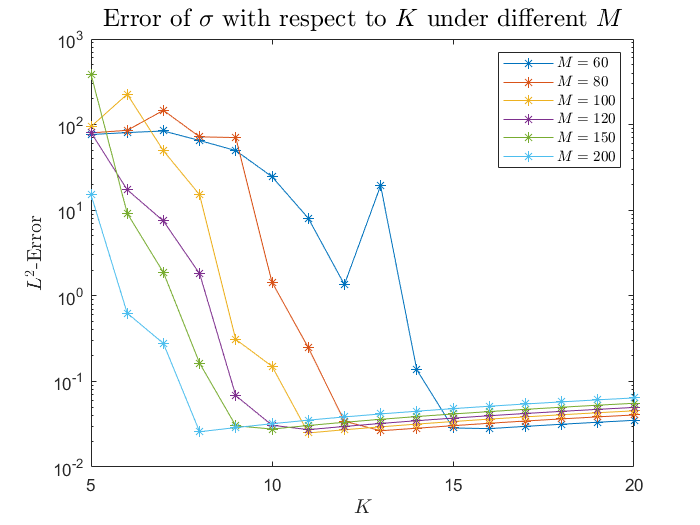

# 使用方法

在 Matlab 中安装工具箱 inteqdirectsolver.mltbx 即可. 注意本工具箱与大作业中其它工具箱可能冲突, 请在使用前禁用其它工具箱.
使用例见 example.m.

# 数值表现

以 Bessel 方程
```math
    u''(x)+\frac{1}{x}u'(x)+\frac{x^2-100^2}{x^2}=0
```
和边界条件 $u(0)=0,u(600)=1$ 为例. 其对应的 $\sigma$ 为
```math
    \sigma(x)=-\frac{J_{99}(x)}{xJ_{100}(600)}-\frac{(x^2-10100)J_{100}(x)}{x^2J_{100}(600)}-\frac{1}{600x}
```

考虑分划为 $[0,600]$ 上等长的 $M$ 个区间, 每个区间上采用 $K$ 个 Chebyshev 节点离散化. 用直接解得的 $\bar\sigma$ 与真实解做对比, 通过每个区间上 Clenshaw-Curtis 积分近似得到的 $L^2$-范数图像如下:



可以看出, 对于每个固定的分划, 误差首先会随着 $K$ 的增大而变小, 并且在超过某个临界值后一直保持在 $10^{-5}$ 左右. 而分划取的越细, 临界值到来的就越早.

我们也可以反过来看: 当 $K=15$ 时, 取 $60$ 等分的分划便可保证误差较小; 而对于 $K=10$, 区间个数不能小于 $120$; 对于 $K=8$, 区间个数不能小于 $200$. 我们将会用这个指标与自适应算法作比较.
